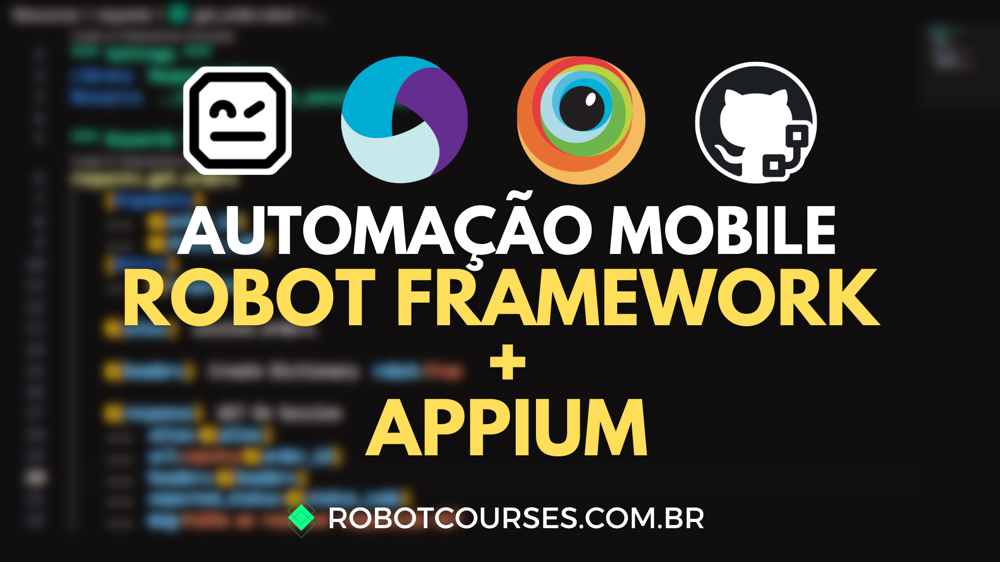
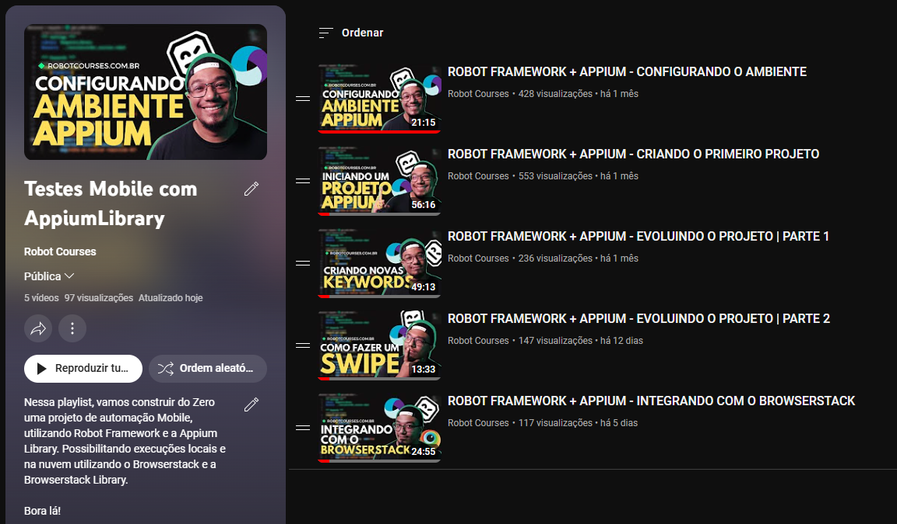

# 📱 Automação Mobile com Robot Framework e Appium



## 👨‍💻 TECNOLOGIAS UTILIZADAS

- Python: https://www.python.org/downloads/release/python-3810/
- Poetry: https://python-poetry.org/docs/
- Robot Framework: https://pypi.org/project/robotframework/
- Appium Library: https://pypi.org/project/robotframework-appiumlibrary/2.0.0/
- Browserstack Library: https://pypi.org/project/robotframework-browserstack/
- VSCode: https://code.visualstudio.com/download
    - Plugin:
        - Robot Framework Language Server: https://marketplace.visualstudio.com/items?itemName=robocorp.robotframework-lsp
        - Python: https://marketplace.visualstudio.com/items?itemName=ms-python.python
        - Android iOS Emulator: https://marketplace.visualstudio.com/items?itemName=DiemasMichiels.emulate


## 🖥️ CONFIGURAÇÃO DO POETRY

[](https://www.youtube.com/watch?v=1z4JDp-Ky9g)


## 🦾 INSTALANDO DEPENDÊNCIAS DO PROJETO

```
poetry install
```

## 🎥 PLAYLIST COM A CONSTRUÇÃO DO PROJETO

Todo a construção do projeto está explicada nessa playlist. Mostrando toda a estruturação, cada keyword utilizada, de uma forma que você consiga entender bem.

[](https://www.youtube.com/playlist?list=PLQjtMqeGwTRUqay20tOdwS3oJio4Jt6YJ)


## 📗 POSTS
- [Robot Framework e Appium | PARTE 1 – O que é o Appium?](https://robotcourses.substack.com/p/robot-framework-e-appium-parte-1)
- [Robot Framework e Appium | PARTE 2 – Configurando o Ambiente](hhttps://robotcourses.substack.com/p/robot-framework-e-appium-parte-2)